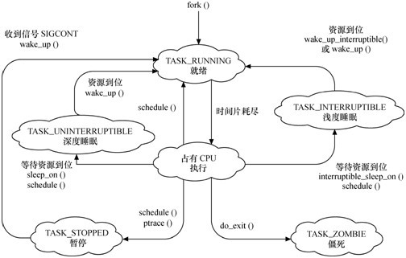

###1.说明进程和程序的区别
程序没有状态，以文件存在。进程有状态，会获得调度，是一个动态的概念

###2.为什么引入进程？
为了分配资源，保护上下文，管理，需要引入进程这个动态概念

##3.PCB是什么
1）状态信息 2)链接信息 3）各种标识符PID等等 4）进程间通信信息(IPC信息） 5）时间和定时器信息
6）调度信息 7）文件系统信息 8）虚拟内存信息 9）处理器环境信息

###4.Linux内核状态有哪些？
  

###6.Linux PCB如何放？为什么？
和内核栈放在同一8KB空间
movl $0xffffe000, %ecx
andl %esp,%ecx //ecx就是PCB的地址

###7.PCB组织方式有几种？为什么这样组织？
task_struct被放在thread_info结构体里面，以为后者使用频率更高，彼此都有指向彼此，也可适应日后调整

###9.一个好的调度算法要考虑什么？
1）公平 2）高效 3）响应时间 4）周转时间 5）吞吐量

###11.什么是写时复制？最大优势是什么时候？
fork()是创建父进程的镜像，所有内存设置为只读，当修改时才真正写入内存。在频繁申请进程，但对内存操作较少有很大效果

###13.0号进程什么时候创建？什么情况下调度执行？
初始化内核工作的start_kernel()创建，只有一个函数cpu_idle(),当没有进程需要调度的时候，会调度该进程，达到节电效果

###14.init内核线程和init进程有什么区别吗？
只有在init内核线程完成工作后，调用exec函数调度用户程序，才成为第一个用户态进程
