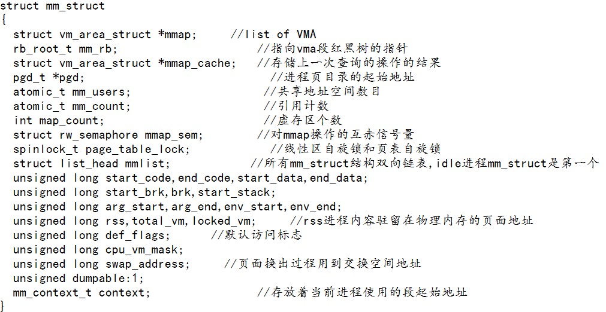
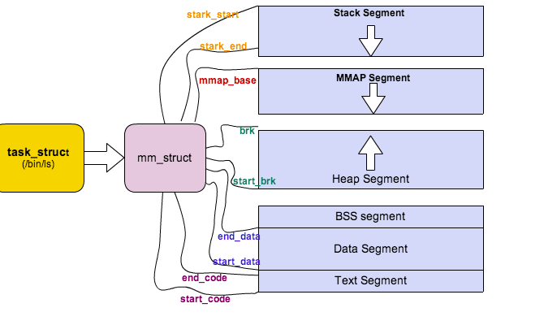
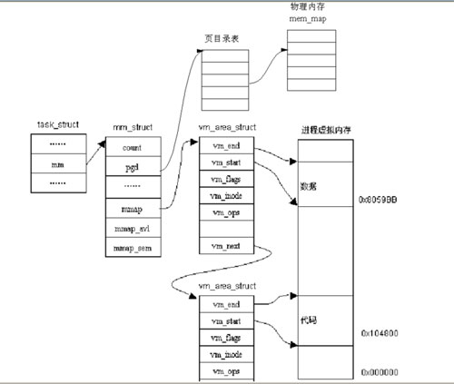
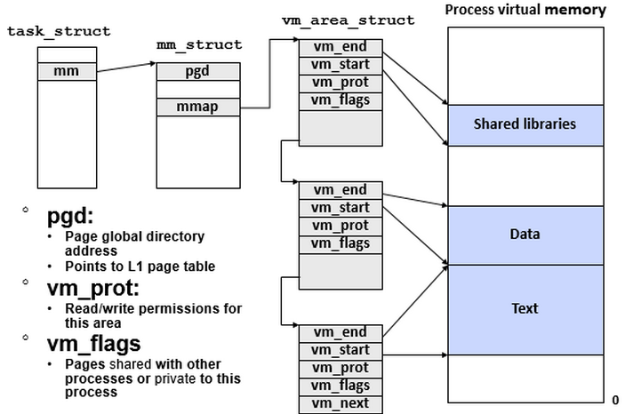
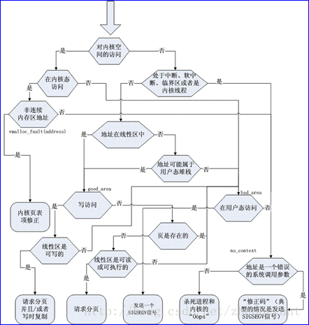

###1.为什么把进程空间分为内核空间和用户空间
因为用户程序都可以通过系统调用进入内核,共享内核空间,就没必要私有了

###2.为什么说每个进程拥有3GB的私有用户空间?
因为每个程序有自己的映射关系,所以3GB是独立的

###3.内核空间放什么内容?如何把一个虚地址转换成物理地址?
放内核代码和数据,减去PAGE_OFFSET即使物理地址,可以使用__pa宏

###4.什么是内核映像?它放在物理空间和内核空间什么地方?
内核代码和数据叫内核映像,放在物理地址0x00100000地方(1MB),也就是内核地址0xC01000000

###5.用户空间分哪及部分?malloc分配的属于哪一部分?
从高地址到低地址依次是:桟 堆 BSS 数据段 代码段 , malloc属于堆部分

###6.mm_struct描述了哪些方面?内核如何组织的?

###7.vm_area_struct描述了哪些方面?内核如何组织的?

###8.为什么把进程的用户空间划分为一个个区间?
方便管理

###10.进程用户空间何时创建?如何创建?
fork()创建了和父进程一样的用户空间

###11.什么是虚存映射?有几种?
把映像链接到用户空间就叫虚存映射 3种:共享映射 私有映射 匿名映射

###12.一个进程通常包含几个虚存区?
共享库的代码段 数据段 BSS段,程序自己的代码段 数据段 BSS段 堆栈段

###13.说明mmap()系统调用功能?写一个拷贝文件程序
将一个文件或者其它对象映射进内存。mmapp配合ftruncate即可

###14.缺页异常处理

###15.Linux如何实现请求调页?
http://blog.chinaunix.net/uid-11480268-id-2872735.html

###16.系统启动后,物理内存布局如何?动态内存放什么?

###17.叙述伙伴算法工作原理
尽可能减少外部碎片，同时允许快速分配与回收物理页面。为了减少外部碎片，连续的空闲页面，根据空闲块（由连续的空闲页面组成）大小，组织成不同的链表（或者orders）。这样所有的2个页面大小的空闲块在一个链表中，4个页面大小的空闲块在另外一个链表中，以此类推。

###18.画出伙伴算法分配和回收图
http://ilinuxkernel.com/?p=1029

###19.Linux为什么采用Slab机制?
对于小内存区的申请，比如说几十或几百个字节，我们用slab机制。

###20.举例说明Slab专用缓冲区和通用缓冲区使用
专用: kmem_cahe_create/alloc/free/destory等函数完成,通常适用于task_struct等频繁使用的相同对象
通用: kmalloc kfree,如中断处理缓冲区

###21.内核非连续空间位于何处?给出创建非连续区代码
VMALLOC_START ~ 4GB处
  char *buf = vmalloc(16 * PAGE_SIZE);
  if(!buf)
    // error
  vfree(buf);

###22.vmalloc和kmalloc区别
vmalloc适用于不要求连续大的空间 malloc适用于小并且要求连续的空间

###23.在页面交换中,必须考虑什么问题?什么页不应该被交换出去?
1)哪些页要换出 2)如何在交换区放页面 3)如何选择被换出的页面
内核的代码和全局量所占的内存

###24.对换出策略分析,发生抖动的概率?这种策略在什么情况下实施有好的效果?
采用P118策略四发生抖动概率很小 , 在系统可用内存低于极限开始实施效果好

###25.分析kswapd运行时机?你认为怎么换出页面合适?
在系统可用内存低于极限开始运行,我认为把不活跃干净的页面,老化时换出比较合适

