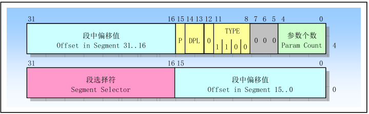

###1.中断和异常的差别？
中断是CPU暂停当前工作，有计划地去处理其他的事情。中断的发生一般是可以预知的，处理的过程也是事先制定好的。处理中断时程序是正常运行的。而异常是CPU遇到了无法响应的工作，而后进入一种非正常状态。异常的出现表明程序有缺陷。

###2.什么是中断向量？Linux怎么分配的？
为每种中断赋予一个中断类型码n,8位无符号整数叫一个向量，在Linux下这样分配：
0  ~ 31    异常和非屏蔽中断
32 ~ 47    屏蔽中断
48 ~ 255   软中断(Linux只用了0x80实现系统调用

###3.什么是中断描述符表？什么是门描述符?
中断描述符表是每个向量对应的门描述符。存入IDTR
#####门描述符: 

###4.门描述符有几种？有什么区别？
有三种：1.中断门(会关中断) 2.陷阱门(不会关中断) 3.系统门(DPL=3)

###5.Call和INT指令区别？
CALL指令段内调用将指令指针IP入栈，段间调用先入栈段基址Cs，再入栈IP。CALL调用RET返回再讲地址弹出，相关变量值改变。而INT指令要先将FLAGS（状态标志位）入栈，再将CS入栈，再将Ip入栈，然后还要将相关寄存器值入栈，IRET返回后，相关寄存器的值不发生变化。

###6.如何对中断描述符表进行初始化？

    setup_idt:
    lea ignore_int,%edx /*计算ignore_int地址的偏移量,并将其装入%edx*/
    movl $(__KERNEL_CS &lt;&lt; 16),%eax /* selector = 0x0010 = cs */
    movw %dx,%ax
    movw $0x8E00,%dx /* interrupt gate - dpl=0, present */
    lea SYMBOL_NAME(idt_table),%edi 
    mov $256,%ecx 
    rp_sidt: 
    movl %eax,(%edi) 
    movl %edx,4(%edi) 
    addl $8,%edi
    dec %ecx 
    jne rp_sidt 
    ret

###7.如何插入一个中断门、陷阱门和系统门？
中断门: 

    static void set_intr_gate(unsigned int n, void *addr){
        _set_gate(idt_table+n, 14, 0, addr);    //DPL = 0, 1110 = 14 32位类型码110
    }
陷阱门:

    static void set_trap_gate(unsigned int n, void *addr){
        _set_gate(idt_table+n, 15, 0, addr);    //DPL = 0, 1111 = 14 32位类型码111
    }
系统门:

    static void set_trap_gate(unsigned int n, void *addr){
        _set_gate(idt_table+n, 15, 3, addr);    //DPL = 3, 1111 = 14 32位类型码111
    }
    
###8.内核如何处理异常？
Linux中为每个IRQ设置了一个队列

    struct irqaction {
    	irq_handler_t		handler;
    	void			*dev_id;
    	void __percpu		*percpu_dev_id;
    	struct irqaction	*next;
    	irq_handler_t		thread_fn;
    	struct task_struct	*thread;
    	unsigned int		irq;
    	unsigned int		flags;
    	unsigned long		thread_flags;
    	unsigned long		thread_mask;
    	const char		*name;
    	struct proc_dir_entry	*dir;
    } ____cacheline_internodealigned_in_smp;

因为分给I/O设备的中断线只有15个，为了让多个设备共享一个数据线，就要利用上述结构体中的dev_id唯一标识，并用next形成链表

###9.画出中断和异常硬件处理流程，并说明CPU为什么要进行有效性检查？如何检查？CPU如何跳到处理程序的？

    1.确定所发生中断或异常的向量i（在0～255之间）。
    2.通过IDTR寄存器找到IDT表，读取IDT表第i项（或叫第i个门）。
    3.分两步进行有效性检查：首先是“段”级检查，将CPU的当前特权级CPL（存放在CS寄存器的最低两位）与IDT中第i项段选择符中的DPL相比较，如果DPL（3）大于CPL（0），就产生一个“通用保护”异常(中断向量13)，因为中断处理程序的特权级不能低于引起中断的程序的特权级。这种情况发生的可能性不大，因为中断处理程序一般运行在内核态，其特权级为0。然后是“门”级检查，把CPL与IDT中第i个门的DPL相比较，如果CPL大于DPL，也就是当前特权级（3）小于这个门的特权级（0），CPU就不能“穿过”这个门，于是产生一个“通用保护”异常，这是为了避免用户应用程序访问特殊的陷阱门或中断门。但是请注意，这种“门”级检查是针对一般的用户程序，而不包括外部I/O产生的中断或因CPU内部异常而产生的异常，也就是说，如果产生了中断或异常，就免去了“门”级检查。
    4.检查是否发生了特权级的变化。当中断发生在用户态（特权级为3），而中断处理程序运行在内核态（特权级为0），特权级发生了变化，所以会引起堆栈的更换。也就是说，从用户堆栈切换到内核堆栈。而当中断发生在内核态时，即CPU在内核中运行时，则不会更换堆栈

为什么要进行有效性检查: 避免用户访问特殊的陷阱和中断门
如何检查: 根据中断向量中选择子的DPL和当前特权等级CPL以及门的DPL比较

CPU如何跳到处理程序的：把中断号-256放入桟后调用统一中断处理代码common_interrupt后调用对应的中断服务程序ISR

###10.中断处理程序和中断服务程序有什么区别？
中断处理程序IH是这个中断号的总处理程序，如果多个设备共享一个中断线，则各个设备可以有自己的中断服务程序ISR

###11.为什么要把中断执行操作进行分类？分为哪几类？
Linux内核把中断处理分成2部分： 上半部和下半部
上半部：只进行很少的工作，通常是标记一下数据到达，后立即开中断
下半部：真正完成中断功能的代码

###12.叙述中断处理程序执行过程，给出函数调用关系
IRQn_interrupt -> do_IRQ() -> handle_IRQ_event() -> ISR1...ISR2

###13.为什么把中断分为2部分来处理？
因为中断处理上半部会关中断，如果处理时间过长,CPU就不能及时响应其他请求

###14.如何声明和使用一个小任务？
声明：

    DECLARE_TASKLET(name,func,data)
    DECLARE_TASKLET_DUSABLED(name,func,data)  设置count = 1，不允许执行
    
使用:
    
    tasklet_schedule(tasklet_struct*);
    tasklet_disable(tasklet_struct*);
    tasklet_enable(tasklet_struct*);
    
###15.实时时钟和操作系统时钟有什么不同？
实时时钟： 通过CMOS的电池维持，是最原始最底层的时钟数据
OS时钟： 通过8253/8254芯片时钟中断来维持

###16.jiffies表示什么？什么时候增加？
节拍数，是Linux中一个全局变量，每次时钟中断都会增加其值，一秒内增加时钟中断频率HZ

###17.时钟中断服务程序主要操作什么？主要函数功能是什么？

    void do_timer(struct pt_regs *regs{
        jiffies++;
        
        update_process_times(user_mode(regs));
        update_times();
    }
    
主要功能：
    
    1) jiffies加1
    2) 更新资源消耗统计值，系统时间等等
    3) 执行到时定时器
    4) 执行scheduler_tick()函数
    5) 更新墙上时间，放入xtime变量
    6) 计算平均负载值
    
###18.时钟中断下半部分主要做什么？
通过run_lock_timers()去处理到期的定时器

###20.如何使用定时器?
通过init_timer()、add_timer()、schedule()、del_timer()
