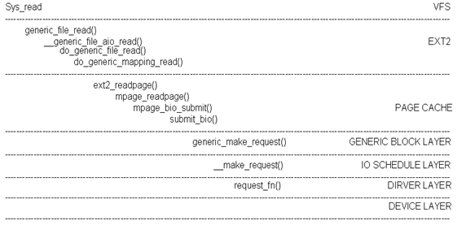

###1.Linux目录树结构怎么形成的？它和WINDOWS有什么区别？为什么采用固定目录形式？
Linxu：一个根目录，下面有一些固定的目录如：bin dev etc等等
Windows：磁盘各个分区作为根目录，没有固定的目录
采用固定目录形式有助于对文件系统和不同的用户进行管理

###2.什么是软链接？什么是硬链接？二者区别？ 
软连接：特殊文件，包含另一文件任意路径，甚至可以不存在，inode号不同
硬链接：在存在的文件上建立一个链接，让一个文件对应多个文件名，有2个限制：

    1. 不允许目录创建
    2. 同一系统文件中才可以创建
    
###3.什么是虚拟文件系统？什么是虚拟文件系统界面？
VFS：屏蔽不同文件系统的细节，而使用系统提供的统一、抽象、虚拟的文件系统界面的框架
虚拟文件系统界面：一组系统调用，能够对不同的文件系统及文件操作

###4.以write()说明VFS如何和具体文件系统结合？
通过struct file中的struct file_operation *f_op抽象对每种文件系统进行操作，write就可以进行file->f_op->write();进行操作

###5.VFS中主要有哪些对象？各自放什么？共同特征是什么？
超级块对象：描述已安装的文件系统
索引结点对象：描述一个文件
目录项对象：描述一个目录项，是路径组成部分
文件对象：描述进程打开的文件
    所有关于操作的部分，都抽象出来，形成一个单独的函数集结构体。

###6.一个文件系统对应一个VFS还是整个系统对应一个VFS?
整个系统对应一个VFS

###7.什么是索引结点？和具体的索引结点什么联系？
处理文件所需要的所有信息结构体。
通过指向操作函数结构体来和特定的文件系统联系

###8.内核如何组织索引结点？为什么要设置多个链表来管理？
加快了查找索引结点

###9.目录项结构和索引结构有什么不同？为什么不合二为一？
索引结构：是描述物理上文件的属性
目录项结构：是描述逻辑上的属性
一个索引结点可能对应多个目录项对象

###10.内核如何组织目录项结构？
例如路径/tmp/test
第一级目录项/
第二级目录项/tmp
第三级目录项/tmp/test

###11.为什么不把文件位置放在索引结点中呢？
避免多进程的读写操作影响

###12.假设一个进程读方式打开文件，后fork()，那子进程和父进程读写有什么关系？
共享一个文件项,所以读写操作会影响同一文件偏移

###13.结合用户打开表说明什么是文件描述符？
用来描述打开文件，放在files_struct中的fd_array中

###15.文件系统合适注册和安装？
注册：将要注册的文件系统信息写入file_systems链表中
安装：对超级块信息等进行处理

###16.画出mount()系统调用流程图
http://blog.csdn.net/skyflying2012/article/details/9748133

###18.读操作逻辑流

